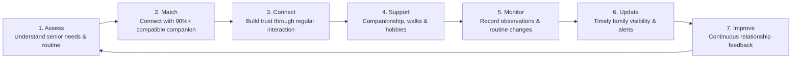

# साथी (Saathi / Saath) — Intergenerational Companionship & Family Visibility Platform
> *"We give seniors someone they know, trust and look forward to seeing — and give their families visibility and peace of mind from anywhere."*

---

## 🎯 1. Problem Identified & Root Cause Analysis

```
        [ROOT CAUSE]
Children live away from parents
        /            \
       v              v
[Senior Impact]       [Family Impact]
• Loneliness          • Anxiety / worry
• Isolation           • Lack of physical proximity
• Reduced engagement  • Coordination difficulty
```

- **For the Senior Citizen**: Living alone leads to social isolation, silence in the house, lack of regular engagement, and absence of someone to talk or take walks with.
- **For the Family (Children living in Bangalore, Mumbai, or Abroad)**: Intense anxiety, worry, inability to be physically present, and lack of day-to-day visibility into their aging parents' emotional and routine wellbeing.
- **The Core Solution**: A closed-loop companionship platform pairing elders with vetted 1:1 student companions, while streaming structured **"Know My Normal" Observation Reports** to their children anywhere in the world.

---

## 🔄 2. The 7-Step Continuous Care Cycle



---

## 📦 3. The 4 Service Models Implemented

| Model | Name | Target User | Mechanism | Price / Structure |
| :--- | :--- | :--- | :--- | :--- |
| **Model 1** | **Pay-Per-Visit / On-Demand** | Occasional needs | Senior or Family books a single session (Chess, Walk, Errands) $\rightarrow$ Visit completed $\rightarrow$ Family gets alert | **₹150 / hour** |
| **Model 2** | **Monthly Companion Plan** | Regular weekly connection | 4 visits/mo (Silver, ₹599) or 8 visits/mo (Gold, ₹1,099) with scheduled check-in calls and routine support | **From ₹599 / month** |
| **Model 3** | **Family-Managed Remote Care Hub** | Out-of-city children (Bangalore, USA) | Family sponsors care from afar $\rightarrow$ Platform coordinator assigns dedicated student $\rightarrow$ Structured post-visit observation logs | **Zero Stress** |
| **Model 4** | **Institutional & Partner Model** | Hospitals & Companies | Post-discharge non-clinical companionship for hospitals, employee parent-care benefits, and senior living communities | **B2B / Partner** |

---

## 🛡️ 4. Trust & Safety Strategy: Verify → Train → Monitor

1. **Verify**:
   - Official College Identity Card verification (ADCET, KIT, Walchand, DY Patil, COEP).
   - Background verification and senior consent before service initiation.
   - Identified in need via NGOs, hospitals, and local community referrals.
2. **Train**:
   - Companion training and safety orientation.
   - **Strict Zero-Financial Rule**: Companions never handle bank accounts, OTPs, PINs, or valuables.
3. **Monitor**:
   - Scheduled & recorded visits with calendar coordination.
   - **Know My Normal** baseline deviation tracking (mood, mobility, energy).
   - Dedicated family notification loop via SMS, WhatsApp, and in-app feeds.
   - Transparent complaint and escalation mechanism.

---

## 💡 5. Novelty Highlights

- **1:1 Companion (One Senior $\rightarrow$ One Companion)**: Highly scalable (1:100+ ratio across city clusters), deeply feasible, and cost-effective.
- **Know My Normal / Normal Detection**: Companions log mood (*Cheerful / Content / Quiet / Low Energy*), mobility (*Walked Comfortably / Veranda Stroll*), and engagement levels after every visit. Deviations automatically trigger family alerts.
- **Personalized Engagement Library**: Hobbies tailored to generational memories (Chess, Marathi literature reading, Bhajans, smartphone tutorials, terrace gardening).
- **Trusted Support Circle**: Seamless integration between Senior, Student, Family Member, and Platform Moderation.

---

## 🎮 6. Interactive Roles & Live Walkthrough

The top black demo switcher bar allows switching between all perspectives:

1. **👴 Senior (Rajendra Kulkarni, 68 — Kolhapur)**:
   - High-contrast, large-button elder dashboard.
   - Discovery with **94% Compatibility Match** for Aditya Patil.
   - 5-step booking flow, simulated UPI checkout, and confirmed session receipt.
   - My Bookings with 5-star review submission and tags.
   - Safety Center with Emergency SOS modal (helpline 14567 / 112).
2. **🎓 Student Companion (Aditya Patil, 21 — ADCET College)**:
   - Companion Hub with real-time stats and incoming request cards.
   - One-click **Accept / Decline** requests.
   - **Log Visit Observation Card ✍️**: Post-visit mood and mobility logger that transmits to Bangalore.
   - Weekly availability scheduler and simulated earnings payout.
3. **👨‍👩‍👧 Family Member (Amit Kulkarni — Son in Bangalore)**:
   - **Family Visibility Hub**: Real-time peace of mind from Bangalore.
   - "Know My Normal" wellness tracker (Mood: Cheerful & Active).
   - Live **Companion Observation Feed** showing visit reports from Aditya.
   - Active care plan management (Model 2/3 Gold Plan).
   - Direct chat with student companion Aditya.
4. **🛡️ Admin Control Room**:
   - KPI analytics, college ID verification queue (Approve/Reject), and safety audit logs.

---

## 🚀 7. Running the Application Locally

```powershell
cd d:\Saath
npm run dev
```
Open **[http://localhost:3000/](http://localhost:3000/)** in your web browser.
